# Translation Bot sample

## Overview
The main idea of this sample is to show the user how a PVA Bot can be used as a Skill using all its topics in different languages, by using a middleware (Azure Bot) to translate the messages between the user and the PVA Bot. The middleware will be using Cognitive services to translate the texts during the entire conversation.

## Prerequisites

- An Azure subscription
- An Azure Cognitive resource deployed on Azure
- Optional: A custom dictionary already published

[Here](https://docs.microsoft.com/en-us/azure/cognitive-services/translator/translator-how-to-signup) is additional information on how to create the Cognitive or Translator service.

## Bot resources list
These are the Bot resources needed by the sample:
- An Azure Bot (middleware)
- A PVA Bot (skill)

## Features
The sample supports the following features:
- Basic text translation
- Adaptive cards and Flows translations
- Custom dictionaries
- Omnichannel integration

## How the bot works
1.	The user sends a message to the PVA bot
2.	The middleware (Azure Bot) intercepts the message and translates it (if needed) to the PVA Bot's language before sending it
4.	The PVA bot will receive the message and trigger a topic based on the user's message
3.	The PVA bot response is sent back to the user
4.	The middleware intercepts and translates the message back (if needed) based on the user's language
7.	The user gets the message

Architecture diagram:
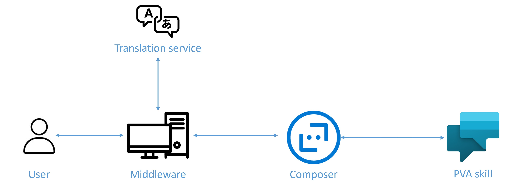

## Azure Bot (middleware) settings
- MicrosoftAppId=Application Id of the app registration used for the bot (this will be completed automatically by Composer).
- MicrosoftAppPassword=Secret for the app registration used for the bot (this will be completed automatically by Composer).
- TranslatorKey=The value in the Azure secret key for the Translator's subscription.
- TranslatorRegion=The region of the multi-service or regional translator resource.
- TranslatorCategoryId=(Optional) The category dictionary is used to implement a custom dictionary for cognitive services and it is compounded by:
  - key: is the source language. E.g.: "en"
  - categoryId: is the category Id for the custom dictionary
    For example:
        "TranslatorCategoryId": {
            "en": {
                "dictionary": "category-id"
            }
        },
- BotLanguage=PVA Bot's language.
- DetectLanguageOnce=Setting to enable language detection on the first message or every message received from the user.
- GetLanguageFromUri=Setting to get the language to be used in the conversation. It will be received through the connection endpoint.
    For example:
    ```
    http://localhost:3979/api/messages/es

## Deploy to azure from Bot Framework Composer
### Open the Bot solution
1. From the Home tab, open the Bot solution.
2. Verify that the Bot solution was opened and is ready for deployment.

### Sign-in to Azure
1. Select Publish in the navigation pane.
2. In the Publish your bots pane, select the Publish tab.
3. Select the bot you want to publish.
4. In the Publish target section, select Manage profiles from the drop-down menu.

    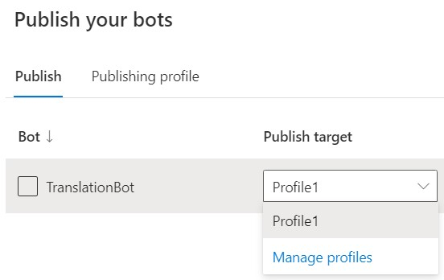

5. In the next display pane, select Add new in the Publishing Profile.

    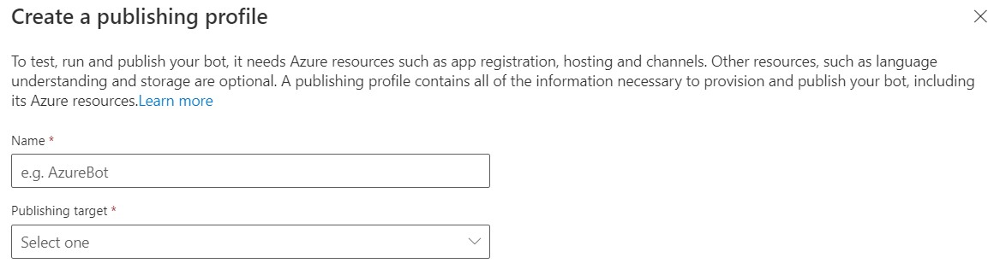

6. You will then see the Sign-in into Azure. Enter the required information. After signing, you must select one of the following options:
    - Create Azure resources: To provision new Azure resources and publish a bot.
    - Import existing Azure resources: To import existing Azure resources and publish a bot.
    - Handoff to an administrator: To request your Azure admin to provision resources on your behalf and publish a bot.

### Create Azure resources
1. Once you are signed in to Azure from Composer, select Create new resources. Read the instructions on the right side of the screen and select Next.

    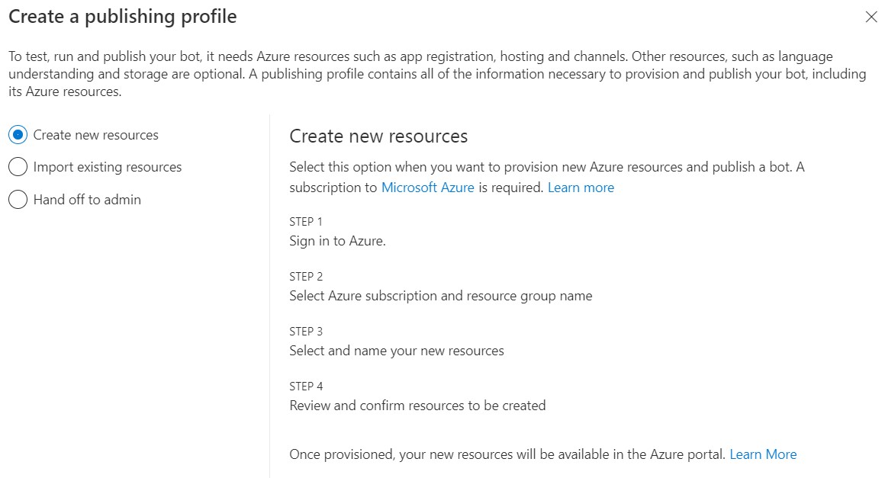

2. In the Configure resources pop-up window, provide the requested information. Remember to select the operating system (Windows or Linux). Based on your template selection when creating the project, runtime (.NET, or Node JS) and your App Service, a default OS selection is assigned.

    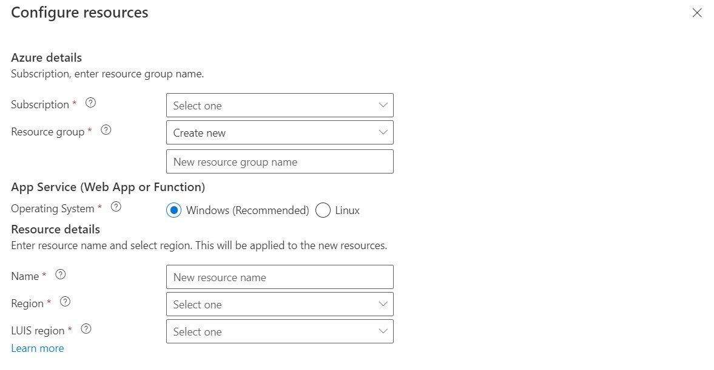

3. Select Next.
4. In the Review & Create window, check the resources that will be created. Select Create.
5. You will see messages in the upper right corner of your Composer with the status of the provisioning process. Once completed it will show the "Provision success" message.
6. After you see the Provision success message on the upper right corner of the Composer screen, the provisioning process is completed. Go to your Azure portal to see the new resources created.

### Publish your bot
1. Select Publish from the Composer menu. Then, select the bot to publish and select a publish profile from the Publish target drop-down list.
2. In the upper left, select Publish selected bots.

    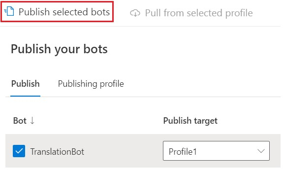

3. In the Publish pop-up window, select Okay to start the publishing process. It will usually take a few minutes to complete. After the publishing process completes, you should see a Success message.

    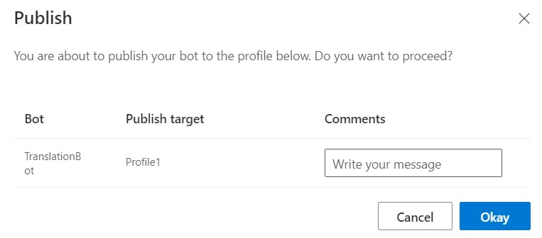

## Add your Azure Bot to the allowlist for your Power Virtual Agents bot
Add the Bot Framework bot's app ID to the allowlist for the Power Virtual Agents bot that you want to use as a skill.

The Bot Framework and Power Virtual Agents bots must be deployed in the same tenant.

1. Expand the Manage section, in Power Virtual Agents, on the side navigation pane for the bot you want to use as a skill, and go to the Skills tab.

2. Select Manage allowlist on the top menu bar.

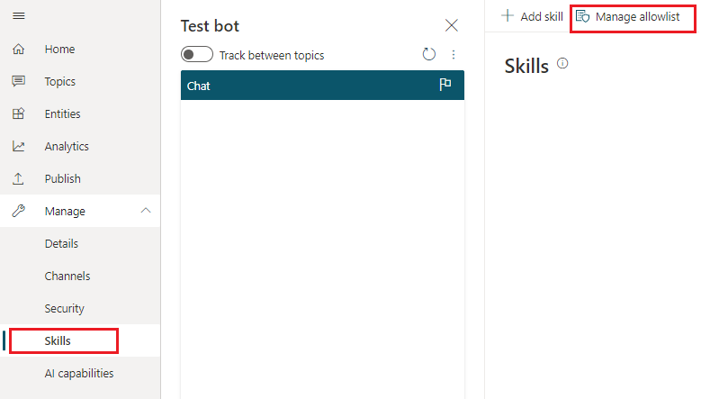

3. Select + Add allowed caller on the Manage allowlist panel.

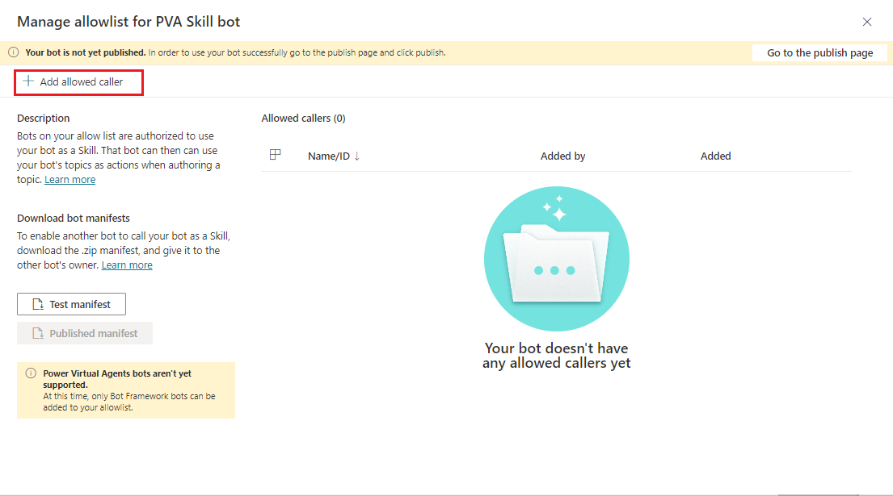

4. Enter your Bot Frameworks bot's app ID and select Next.

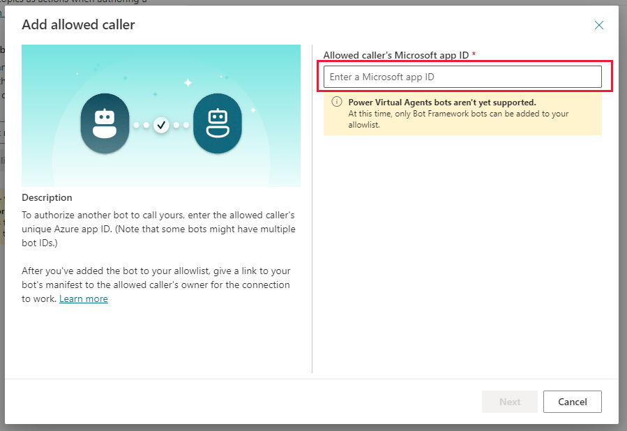

5. You can optionally add a Display name for the bot you've added.

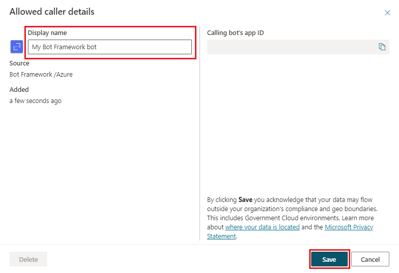

6. Select Save to add your bot to the allowlist.

The Bot Framework bot will be displayed by the Display name (if you entered one) or by its App ID. You can Delete or Edit it at any time from the Manage allowlist panel.

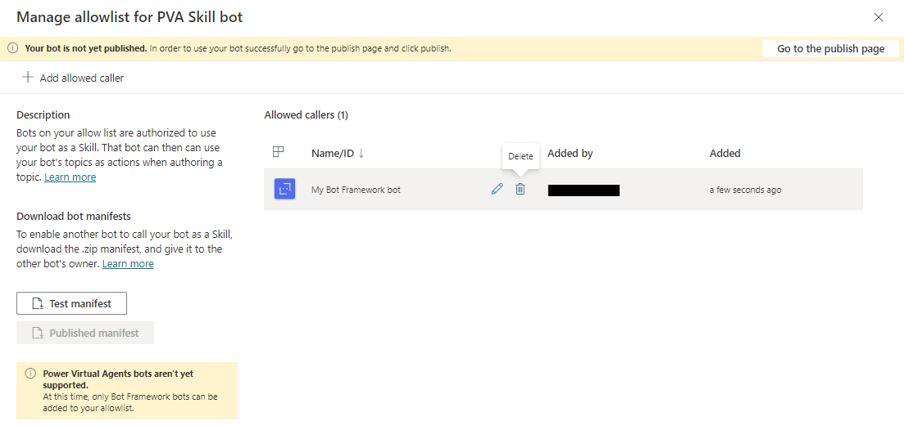

7. Click on the Test manifest button, to download the skill manifest, that will be used in the next step.

## Configure and connect the Azure Bot to the PVA Skill
To configure the Azure Bot, all the settings mentioned in the "Azure Bot settings" section need to be updated with the proper information.
To connect the Azure Bot to the skill, these settings should be also configured in the `appsettings.json` configuration file.
1. Configure the `skill` section (using the endpointUrl and msAppId attributes from the endpoints section included in the manifest file downloaded in the previous step):
        "skill": {
            "pvaSkill": {
                "endpointUrl": "PVA-BOT-ENDPOINT-URL",
                "msAppId": "PVA-BOT-MS-APP-ID"
            }
        },

2. Configure the `allowedCallers` section (using the msAppId attribute from the endpoints section included in the manifest file downloaded in the previous step):
        "skills": {
            "allowedCallers": [
                "PVA-BOT-MS-APP-ID"
            ]
        },

## How to use the bot
1. Get the messaging endpoint of your bot by going to the [Azure Portal](https://portal.azure.com) and click on the Azure Bot resource

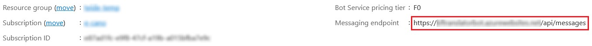

2. Connect to your bot on Bot Framework Emulator by specifying your messaging endpoint, the AppID and AppPassword you used to deploy your bot

3. Enter one of the triggering phrases in order to start the conversation with your skill in the desired language